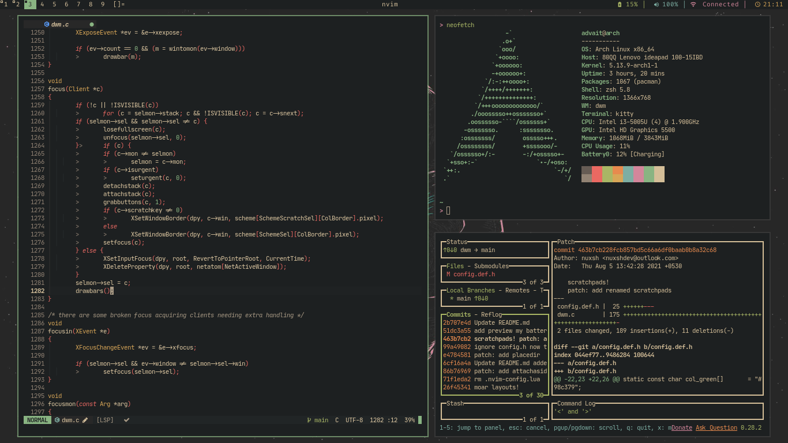

# dwm

dwm is an extremely fast, small, and dynamic window manager for X.

#### Patches:

- status2d
- vanitygaps
- attachasideandbelow
- renamedscratchpads
- swallow
- dragmfact
- dragcfact
- cfacts
- fullscreen-compilation
- placemouse

#### Layouts:

- tile
- monocle
- floating
- spiral
- dwindle
- deck
- bottomstack
- bottomstackhoriz
- grid
- centeredmaster
- centeredfloatingMaster
